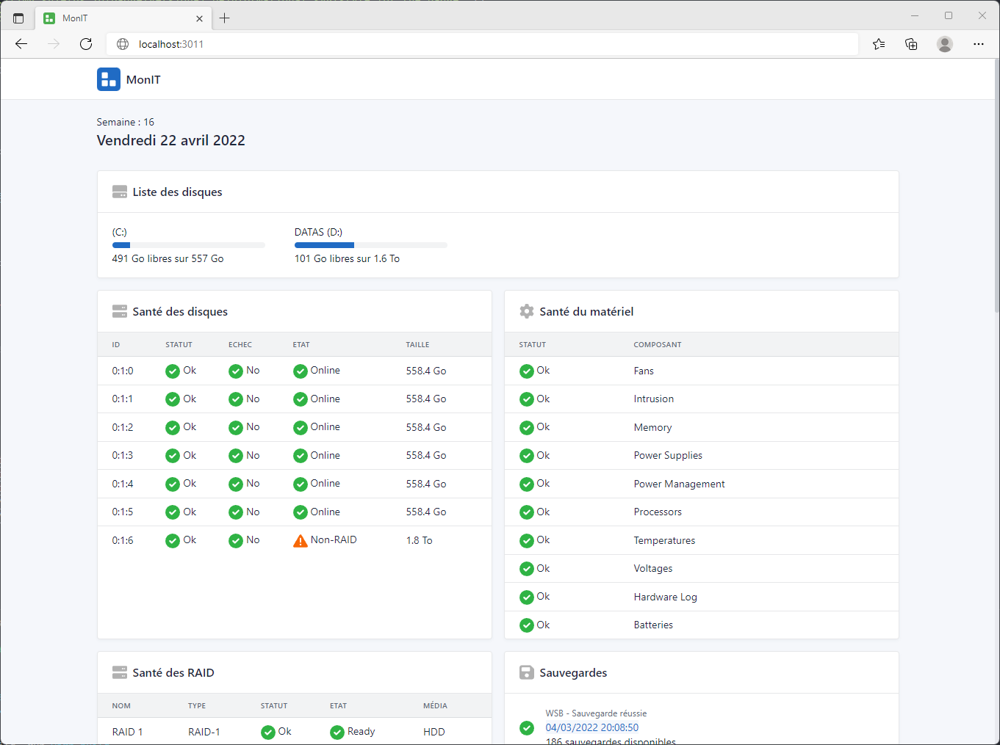

<div align="center">
	
	<h1>MonIT</h1>
	<br/>
	
	
	<!--  -->
	<br/><br/>
</div>

Génèrer un rapport d'information pour les serveurs Windows



## Installation

### Prérequis

- Windows 2012 où supérieur
- Autoriser l'exécution des scripts PowerShell (`Set-ExecutionPolicy Unrestricted -Force`)

Lancer la commande PowerShell suivante :

```powershell
iwr -useb https://raw.githubusercontent.com/Fl0wyn/MonIT/master/scripts/install.ps1 | iex
```

## Exécution

Lancer l'applcation  **MonIT.exe** présent sur le bureau

## Désinstallation

Supprimer l'éxécutable **C:\Windows\Temp\MonIT-Update.exe**

Supprimer le dossier **C:\Exploitation\MonIT** et l'icône sur le bureau

## Ressources

- [Tabler](https://tabler.io/)
- [Speedtest CLI](https://www.speedtest.net/fr/apps/cli)
- [PS2EXE ](https://github.com/MScholtes/PS2EXE)
