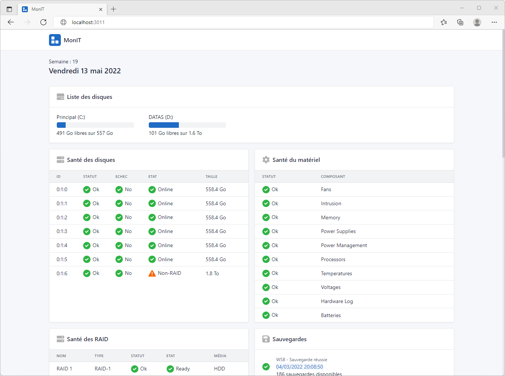

<div align="center">
	
	<h1>MonIT</h1>
	<br/>
	
	
	<!--  -->
	<br/><br/>
</div>

Génèrer un rapport d'information pour les serveurs Windows (🇫🇷)



## Installation

### Prérequis


```powershell
...
```

## Exécution

Lancer l'applcation 

<div style="display:flex; align-items:center; gap:.3em">
	 MonIT.exe
</div>

